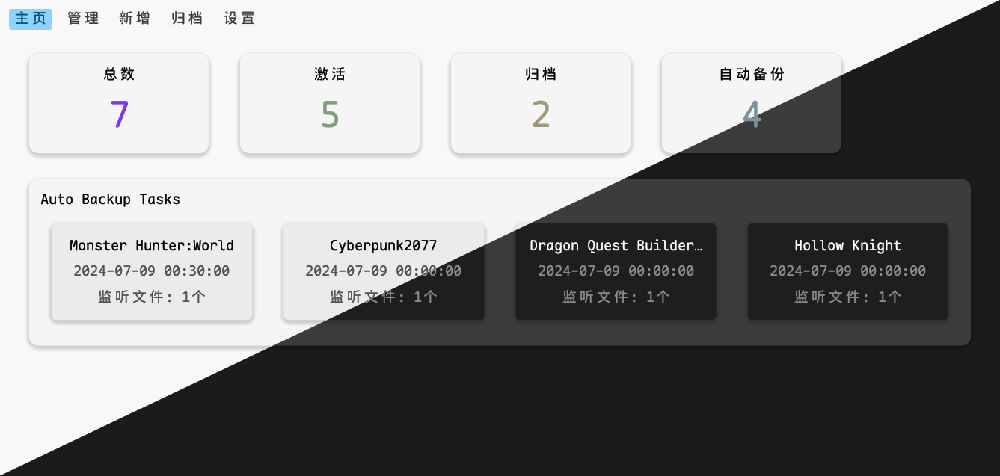
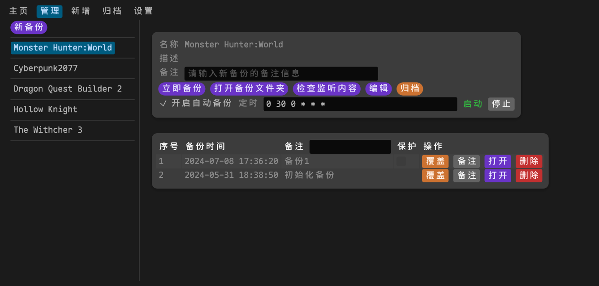
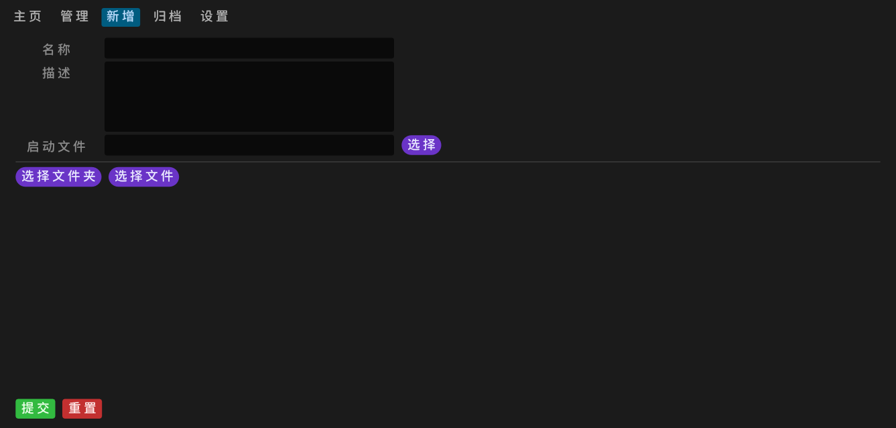
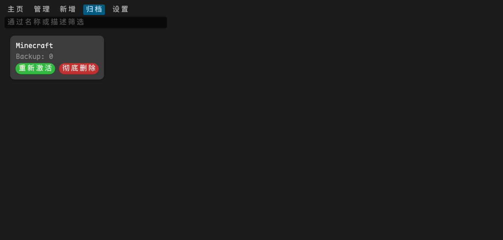

# 介绍

这是一款使用 rust 编写的游戏存档管理工具。

功能特性：

 - 支持游戏备份和恢复
 - 支持自动备份，使用 cron 设置自动备份时间
 - 支持备份归档
 - 支持多语言
 - 支持明亮/黑暗主题切换

 # 依赖

- egui：用于 UI 设计
- serde：用于序列化和反序列化
- serde_json：用于 json 序列化和反序列化
- chrono：用于时间处理
- cron：用于定时任务

# 页面展示

主页

 

备份管理



新增备份



归档



设置


# 快速开始

clone 本项目

```sh
cargo run
```

编译项目

```sh
cargo build --release
```

# 日志

- 20240512 完成页面设计
- 20240513 完成功能开发
